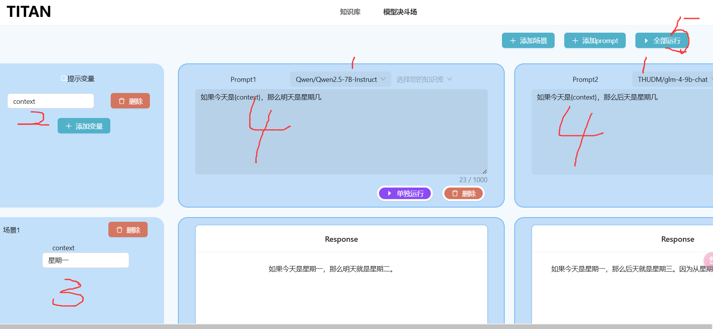

# PromptMatch
PromptMatch is an efficient platform for testing and optimizing prompt templates across AI chatbots. 
User-friendly interface to interact with ChatGPT, chatGLM, and more. 
Compare and analyze chatbot responses for enhanced prompt interactions.

## 项目名称： PromptMatch

## 在线体验地址
http://taitan.prompt-match.cn/

## 项目简介：
PromptMatch 是一个开源的Prompt测试和优化平台，
专为 AI 聊天机器人设计。它允许开发者和研究人员创建、测试和比较各种提示模板，
以提高与聊天机器人的交互效率和效果。
通过 PromptMatch，用户可以轻松地管理多个聊天机器人的Prompt，并对比分析它们的响应，以找到最佳的反馈效果，特别适合多模型应用为每个Prompt选择最优模型。

## 主要功能：

多机器人支持： 支持与 TongYi、chatGLM、LLAMA 等多种 AI 聊天机器人的交互。
用户友好的界面： 提供直观的图形界面，使得非技术用户也能轻松使用。
模板管理： 允许用户创建、编辑和管理自己的提示模板。
响应分析： 提供工具来比较不同提示模板的响应，帮助用户理解哪些模板更有效。
性能优化： 通过分析响应时间和内容质量，帮助用户优化提示模板。
数据可视化： 提供图表和图形，直观展示聊天机器人的响应数据。
跨平台兼容性： 支持在不同操作系统和设备上运行。

## 技术栈：

前端：React
后端：Python FastAPI
数据库：PostgreSQL

## 使用方式
查看两个项目中的 README.md 文件，按照其中的说明，分别启动前端和后端服务。
然后，打开浏览器，访问 http://localhost:3000，即可开始使用 PromptMatch。

## 后续计划
- 优化前端交互体验，添加使用引导
- 优化大模型与RAG集成的场景
- 在agent中集成，方便特定场景使用
